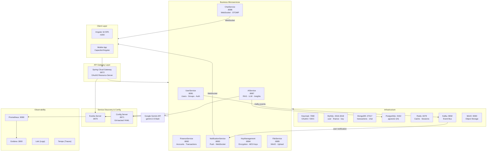
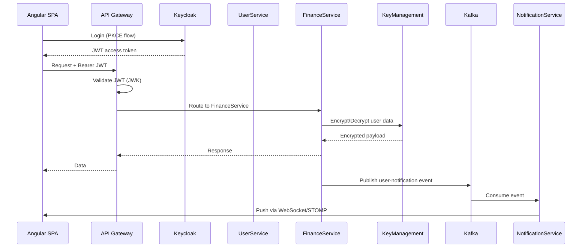
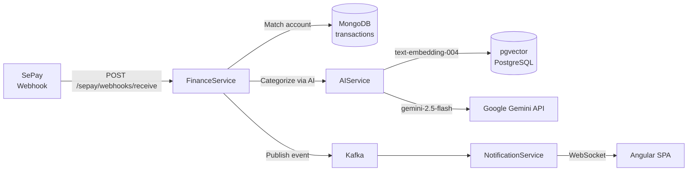

<div align="center">

# FinMind

**A full-stack, cloud-ready Personal Finance Management Platform**

[](https://openjdk.org/projects/jdk/21/)
[](https://spring.io/projects/spring-boot)
[](https://angular.io/)
[](https://www.docker.com/)
[](https://kafka.apache.org/)
[](LICENSE)

[Live Demo](#) · [API Docs](#api-documentation) · [Report Bug](https://github.com/BinhAn1676/FinMind/issues) · [Request Feature](https://github.com/BinhAn1676/FinMind/issues)

</div>

---

## Table of Contents

- [Overview](#-overview)
- [Key Features](#-key-features)
- [Architecture](#-architecture)
- [Tech Stack](#-tech-stack)
- [Project Structure](#-project-structure)
- [Getting Started](#-getting-started)
- [Environment Configuration](#-environment-configuration)
- [Running the Project](#-running-the-project)
- [API Documentation](#-api-documentation)
- [Contributing](#-contributing)
- [License](#-license)

---

## 🧭 Overview

FinMind is a **production-grade personal finance management platform** built on a microservices architecture. It enables individuals and groups to track income and expenses, manage budgets, monitor financial goals, and communicate in real-time — all secured with enterprise-grade authentication and end-to-end data encryption.

The project demonstrates modern backend engineering practices including event-driven architecture, distributed configuration, circuit-breaking, observability, and AI-powered financial insights via Google Gemini and a RAG pipeline.

> **Scope:** 9 business microservices · 1 API Gateway · Angular 16 SPA · Centralized YAML config · Full observability stack · GitHub Actions CI/CD

---

## ✨ Key Features

### 💰 Finance Management
- Create and manage multiple financial accounts (bank, cash, e-wallet)
- Record income / expense transactions with categories and notes
- Auto-sync transactions from **SePay** (OAuth2 webhook integration)
- Schedule recurring transactions (daily / weekly / monthly / yearly) via **Quartz Scheduler**
- Export financial reports to Excel (Apache POI)
- Savings Goals (personal & group) with auto-save scheduler
- Bill Reminders with cron-based scheduling and financial calendar view

### 👥 Group Finance
- Create shared finance groups with member invitations
- Group budgeting and planning with per-category budget allocation
- Real-time group activity feed and notifications
- Group savings goals with contribution tracking

### 📊 Analytics & AI Insights
- Visual dashboards with spending trends (ApexCharts / Highcharts)
- **AI-powered financial advisor** using **Google Gemini** (`gemini-2.5-flash`)
- RAG pipeline with `pgvector` + `text-embedding-004` embeddings (Google) for context-aware advice
- Automated spending anomaly detection and savings suggestions
- Crypto/investment portfolio tracking with real-time profit calculation (CoinGecko API)
- Light/dark theme support

### 💬 Real-Time Communication
- Group and direct messaging with WebSocket / STOMP
- Typing indicators, read receipts, message history
- Real-time push notifications (Kafka → WebSocket delivery)

### 🔐 Security & Privacy
- OAuth2 / OIDC authentication via **Keycloak**
- Per-user **AES encryption** for sensitive financial data
- Two-tier key management: Google Cloud KMS (production) / local passthrough (development)
- JWT role-based access control with method-level `@PreAuthorize`

### 📁 File Management
- Upload profile pictures, receipts, and documents (up to 500 MB)
- **MinIO** (S3-compatible) object storage with presigned URL delivery
- Automatic duplicate detection and scheduled cleanup

---

## 🏗 Architecture

### System Overview



### Service Communication



### Data Flow — Transaction Sync (SePay)



---

## 🛠 Tech Stack

### Backend

| Category | Technology | Version |
|---|---|---|
| Language | Java | 21 |
| Framework | Spring Boot | 3.4.5 |
| Cloud | Spring Cloud | 2024.0.1 |
| Build | Gradle | 8.5 |
| Security | Spring Security + Keycloak | 26.0.7 |
| Service Discovery | Eureka (Netflix) | – |
| API Gateway | Spring Cloud Gateway (WebFlux) | – |
| Messaging | Apache Kafka (KRaft, no ZooKeeper) | 3.8.0 |
| Caching | Redisson | 3.47.0 |
| Circuit Breaker | Resilience4J | – |
| Scheduler | Quartz Scheduler | – |
| AI / LLM | Google Gemini API (gemini-2.5-flash + text-embedding-004) | – |
| Observability | OpenTelemetry Java Agent | 2.11.0 |
| Metrics | Micrometer + Prometheus | – |
| Excel | Apache POI | – |

### Frontend

| Category | Technology | Version |
|---|---|---|
| Framework | Angular | 16.2.0 |
| Language | TypeScript | 5.1.3 |
| UI Components | PrimeNG + Bootstrap | 15 / 5.3 |
| Charts | ApexCharts + Highcharts | – |
| Real-time | STOMP.js + SockJS | 7.2.1 |
| Auth | keycloak-angular | 14.4.0 |
| i18n | ngx-translate | – |

### Databases & Infrastructure

| Service | Role | Port |
|---|---|---|
| MySQL 8.0 | user (3316) · finance (3317) · key (3318) | 3316–3318 |
| MongoDB 7 | Transactions, chat messages, notifications, files | 27017 |
| PostgreSQL 16 (pgvector) | AI vector embeddings (RAG) | 5432 |
| Redis | Session cache, key cache, vector store | 6379 |
| MinIO | S3-compatible file object storage | 9000 |
| Kafka 3.8 | Async event bus (KRaft mode) | 9092 / 9194 |
| Keycloak 26 | OAuth2 / OIDC identity provider | 7080 |

---

## 📁 Project Structure

```
FinMind/
├── FinanceManagement/              # Backend — 9 microservices
│   ├── AIService/                  # AI advisor, RAG, financial insights
│   ├── ChatService/                # Real-time chat (WebSocket/STOMP)
│   ├── ConfigServer/               # Spring Cloud Config (Git-backed)
│   ├── EurekaServer/               # Service discovery registry
│   ├── FileService/                # File uploads, MinIO integration
│   ├── FinanceService/             # Core finance: accounts, transactions, budgets
│   ├── KeyManagementService/       # AES key generation, encryption/decryption
│   ├── NotificationService/        # Kafka consumer → WebSocket push
│   ├── UserService/                # Users, groups, invitations, profiles
│   ├── gatewayserver/              # API Gateway, OAuth2 validation, routing
│   ├── environment/                # Docker Compose for full infrastructure
│   │   ├── docker-compose.yml
│   │   ├── docker-compose.prod.yml
│   │   ├── setup.sh
│   │   └── .env.example
│   └── .github/
│       └── workflows/
│           ├── deploy-backend.yml  # CI/CD — builds & deploys all services
│           └── deploy-frontend.yml
│
├── FinanceManagementFE/            # Frontend — Angular 16 SPA
│   ├── src/
│   │   ├── app/
│   │   │   ├── components/         # Feature components (transactions, budgets, savings-goals, bill-reminders, financial-calendar, analytics, chat, groups, profile, ...)
│   │   │   ├── services/           # Business logic services (transaction, account, savings-goal, bill-reminder, investment-lot, portfolio-coin, market-data, theme, ...)
│   │   │   ├── model/              # TypeScript domain models
│   │   │   ├── routeguards/        # Keycloak auth guard
│   │   │   ├── interceptors/       # HTTP loading interceptor
│   │   │   └── constants/          # App-wide constants
│   │   ├── assets/
│   │   │   └── i18n/               # en.json, vi.json translations
│   │   └── environments/           # dev / prod environment configs
│   └── Dockerfile
│
├── FinancesConfig/                 # Centralized YAML configs (Git-backed)
│   ├── ai.yaml
│   ├── chat.yaml
│   ├── files.yaml
│   ├── finances.yaml
│   ├── gatewayserver.yaml
│   ├── keys.yaml
│   ├── notify.yaml
│   ├── users.yaml
│   └── .env.example
│
└── README.md
```

### Backend Service Structure (per service)

```
{ServiceName}/
├── Dockerfile                      # Multi-stage: gradle:8.5-jdk21 → temurin:21-alpine
├── build.gradle                    # Dependencies and build config
├── settings.gradle
├── gradlew / gradlew.bat
└── src/
    └── main/
        ├── java/com/finance/{service}/
        │   ├── {Service}Application.java
        │   ├── config/             # Spring beans, security, WebSocket, etc.
        │   ├── controller/         # REST / WebSocket controllers
        │   ├── service/            # Business logic
        │   ├── repository/         # JPA / MongoDB repositories
        │   ├── entity/ | document/ # DB entities
        │   ├── dto/                # Request / Response DTOs
        │   ├── feign/              # Feign clients (inter-service calls)
        │   ├── event/              # Kafka event DTOs
        │   └── exception/          # Global exception handler
        └── resources/
            └── application.yaml    # Bootstrap config (port, cloud config URI)
```

---

## 🚀 Getting Started

### Prerequisites

Ensure the following are installed on your machine:

| Tool | Version | Install |
|---|---|---|
| Docker & Docker Compose | 24+ | [docs.docker.com](https://docs.docker.com/get-docker/) |
| Java JDK | 21 | [openjdk.org](https://openjdk.org/install/) |
| Gradle | 8.5 | [gradle.org](https://gradle.org/install/) |
| Node.js | 18+ | [nodejs.org](https://nodejs.org/) |
| Angular CLI | 16 | `npm install -g @angular/cli@16` |
| Git | – | [git-scm.com](https://git-scm.com/) |

### Clone the Repository

```bash
git clone https://github.com/BinhAn1676/FinMind.git
cd FinMind
```

---

## ⚙️ Environment Configuration

Before starting any service, configure the required environment variables.

### 1. Infrastructure (Docker Compose)

```bash
# Copy example and fill in your host IP
cp FinanceManagement/environment/.env.example FinanceManagement/environment/.env
```

```env
# FinanceManagement/environment/.env

# Your machine's LAN IP (run: hostname -I | awk '{print $1}')
HOST_IP=192.168.1.100
```

### 2. Config Server

```bash
cp FinanceManagement/ConfigServer/src/main/resources/.env.example \
   FinanceManagement/ConfigServer/src/main/resources/.env
```

```env
# FinanceManagement/ConfigServer/src/main/resources/.env

GITHUB_USERNAME=your_github_username
GITHUB_PAT=ghp_xxxxxxxxxxxxxxxxxxxxxxxxxx   # GitHub Personal Access Token (repo read)
ENCRYPT_KEY=your_32_char_symmetric_key       # Used to decrypt {cipher} values in YAML
KAFKA_BOOTSTRAP_SERVERS=kafka1:9092          # Internal Kafka address (Docker network)
```

### 3. FinancesConfig Secrets

```bash
cp FinancesConfig/.env.example FinancesConfig/.env
```

```env
# FinancesConfig/.env

MAIL_USERNAME=your_email@gmail.com
MAIL_PASSWORD=xxxx xxxx xxxx xxxx           # Gmail App Password (16 chars)
MINIO_ACCESS_KEY=your_minio_access_key
MINIO_SECRET_KEY=your_minio_secret_key
TWILIO_ACCOUNT_SID=ACxxxxxxxxxxxxxxxxxxxxxxxxxxxxxxxx
TWILIO_AUTH_TOKEN=xxxxxxxxxxxxxxxxxxxxxxxxxxxxxxxx
TWILIO_FROM_NUMBER=+1xxxxxxxxxx
```

### 4. Keycloak Setup

After Keycloak starts (port `7080`), create the realm and client:

```
Realm:       finance
Client ID:   finance-auth-server
Client Type: Public (PKCE)

Valid Redirect URIs:
  http://localhost:4200/*
  http://localhost/*

Web Origins:
  http://localhost:4200
```

> **Tip:** Import the realm configuration file from `FinanceManagement/environment/keycloak/` if provided, or configure manually via the Keycloak Admin Console at `http://localhost:7080/admin`.

---

## ▶️ Running the Project

### Step 1 — Start Infrastructure

```bash
cd FinanceManagement/environment

# First-time setup (generates MongoDB keyfiles, creates directories)
./setup.sh

# Start all infrastructure services
docker compose up -d
```

**Verify infrastructure health:**

```bash
docker compose ps
# All services should show "healthy" or "running"
```

| Service | URL | Credentials |
|---|---|---|
| Keycloak Admin | http://localhost:7080/admin | admin / admin |
| Kafka UI | http://localhost:8080 | – |
| MinIO Console | http://localhost:9001 | loki / supersecret |
| Grafana | http://localhost:3000 | admin / admin |

---

### Step 2 — Start Backend Services

Services **must** be started in this order:

```bash
# 1. Config Server — provides config to all other services
cd FinanceManagement/ConfigServer
./gradlew bootRun

# 2. Eureka Server — service registry
cd FinanceManagement/EurekaServer
./gradlew bootRun

# 3. Business services (open separate terminals, order flexible)
cd FinanceManagement/UserService        && ./gradlew bootRun
cd FinanceManagement/FinanceService     && ./gradlew bootRun
cd FinanceManagement/NotificationService && ./gradlew bootRun
cd FinanceManagement/KeyManagementService && ./gradlew bootRun
cd FinanceManagement/FileService        && ./gradlew bootRun
cd FinanceManagement/ChatService        && ./gradlew bootRun
cd FinanceManagement/AIService          && ./gradlew bootRun

# 4. API Gateway — start last
cd FinanceManagement/gatewayserver      && ./gradlew bootRun
```

**Verify all services registered:**
Open Eureka Dashboard → [http://localhost:8070](http://localhost:8070)

All 9 services should appear as `UP`.

---

### Step 3 — Start Frontend

```bash
cd FinanceManagementFE
npm install
npm start
```

Open your browser at **[http://localhost:4200](http://localhost:4200)**

---

### Docker Production Mode

To run everything with Docker (as in production):

```bash
cd FinanceManagement/environment

# Build and start all services
docker compose -f docker-compose.prod.yml up -d

# View logs for a specific service
docker compose -f docker-compose.prod.yml logs -f financeservice
```

**Build individual service Docker image:**

```bash
# Example: FinanceService
cd FinanceManagement/FinanceService
./gradlew build -x test
docker build -t finmind/finance-service:1.0 .
```

---

### Service Port Reference

| Service | Port | Description |
|---|---|---|
| Angular SPA | 4200 | Frontend dev server |
| API Gateway | 8072 | Single entry point for all API calls |
| Eureka Dashboard | 8070 | Service registry UI |
| Config Server | 8071 | Config API |
| UserService | 8081 | User & group APIs |
| FinanceService | 8082 | Finance & transaction APIs |
| NotificationService | 8083 | Notification APIs + WebSocket |
| KeyManagementService | 8084 | Encryption APIs |
| FileService | 8085 | File upload APIs |
| ChatService | 8086 | Chat APIs + WebSocket |
| AIService | 8087 | AI advisor APIs |
| Keycloak | 7080 | OAuth2 identity provider |
| Kafka UI | 8080 | Kafka monitoring |
| Grafana | 3000 | Metrics & log dashboards |

---

## 📖 API Documentation

All APIs are accessible through the **API Gateway** at `http://localhost:8072`.

Authentication: `Authorization: Bearer <keycloak_jwt_token>`

### Core Endpoints

```
# Auth — handled by Keycloak
POST  http://localhost:7080/realms/finance/protocol/openid-connect/token

# Finance
GET   /finances/api/v1/accounts          # List financial accounts
POST  /finances/api/v1/transactions      # Create transaction
GET   /finances/api/v1/statistics        # Spending analytics

# Users & Groups
GET   /users/api/v1/profile              # Current user profile
POST  /users/api/v1/groups               # Create group
POST  /users/api/v1/groups/{id}/invite   # Invite member

# Files
POST  /files/api/v1/upload               # Upload file (multipart)
GET   /files/api/v1/{fileId}/url         # Get presigned download URL

# AI — chat goes through ChatService (send message to AI_BOT_001 room)
POST  /chat/api/v1/chat/rooms/{roomId}/messages   # Send message to AI_BOT_001
GET   /ai/api/ai/analytics/dashboard              # AI analytics dashboard
GET   /ai/api/ai/insights                         # AI-generated spending insights

# WebSocket endpoints (via Gateway)
ws://localhost:8072/ws                   # Notifications (STOMP)
ws://localhost:8072/chat/ws              # Chat (STOMP)
```

### Example — Create a Transaction

```bash
curl -X POST http://localhost:8072/finances/api/v1/transactions \
  -H "Authorization: Bearer $TOKEN" \
  -H "Content-Type: application/json" \
  -d '{
    "accountId": "acc_123",
    "amount": 150000,
    "type": "EXPENSE",
    "categoryId": "cat_food",
    "note": "Lunch with team",
    "transactionDate": "2025-03-10T12:00:00"
  }'
```

### Example — AI Financial Advisor

> Chat with AI is handled via ChatService. Send a message to a room that contains `AI_BOT_001` as a participant.

```bash
curl -X POST http://localhost:8072/chat/api/v1/chat/rooms/{roomId}/messages \
  -H "Authorization: Bearer $TOKEN" \
  -H "Content-Type: application/json" \
  -d '{
    "content": "Tháng này tôi chi tiêu có hợp lý không? Gợi ý tiết kiệm cho tôi.",
    "type": "TEXT"
  }'
```

---

## 🤝 Contributing

Contributions are what make the open-source community such an amazing place to learn, inspire, and create. Any contributions you make are **greatly appreciated**.

### Development Workflow

```bash
# 1. Fork the repository
# 2. Clone your fork
git clone https://github.com/BinhAn1676/FinMind.git
cd FinMind

# 3. Create a feature branch
git checkout -b feature/your-feature-name

# 4. Make your changes and commit
git add .
git commit -m "feat: add your feature description"

# 5. Push and open a Pull Request
git push origin feature/your-feature-name
```

### Commit Convention

This project follows the [Conventional Commits](https://www.conventionalcommits.org/) specification:

| Prefix | When to use |
|---|---|
| `feat:` | A new feature |
| `fix:` | A bug fix |
| `docs:` | Documentation changes |
| `refactor:` | Code refactoring (no feature/fix) |
| `test:` | Adding or updating tests |
| `chore:` | Build process or tooling changes |
| `perf:` | Performance improvements |

**Examples:**
```
feat(finance): add recurring transaction scheduler
fix(chat): resolve WebSocket reconnect on token expiry
docs: update environment configuration guide
```

### Adding a New Microservice

1. Create the service directory following the [standard structure](#backend-service-structure-per-service)
2. Add `spring.application.name` to a new YAML file in `FinancesConfig/`
3. Register the service in `FinanceManagement/environment/docker-compose.yml`
4. Add deployment job to `.github/workflows/deploy-backend.yml`
5. Add a route in `FinancesConfig/gatewayserver.yaml`

### Code Style Guidelines

- **Java:** Follow [Google Java Style Guide](https://google.github.io/styleguide/javaguide.html)
- **TypeScript / Angular:** Follow [Angular Style Guide](https://angular.io/guide/styleguide)
- **REST APIs:** Follow RESTful conventions (`/api/v1/{resource}`)
- **DTOs:** Separate request/response DTOs — never expose entities directly
- **Security:** All endpoints require authentication unless explicitly whitelisted in `SecurityConfig`

---

## 📄 License

Distributed under the MIT License. See [`LICENSE`](LICENSE) for more information.

---

<div align="center">

**Built with ❤️ by [Nguyen Binh An](https://github.com/BinhAn1676)**

*If you found this project helpful, please consider giving it a ⭐*

[](https://github.com/BinhAn1676/FinMind)

</div>
